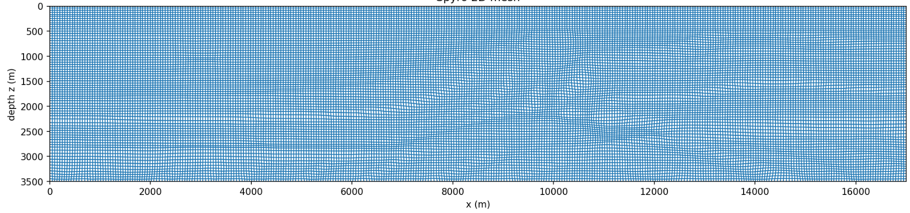
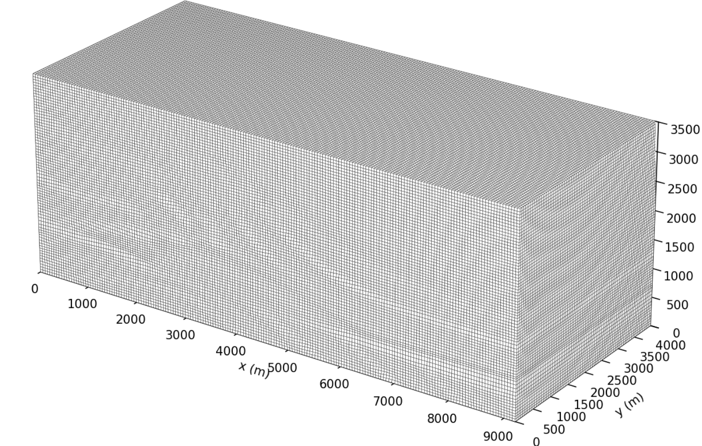

# RobustMesher

**RobustMesher** is a standalone Gmsh meshing framework for two-dimensional and three-dimensional geophysical velocity models. It builds a wavelength-based element-sizing field from SEG-Y or binary data, constructs the model and optional absorbing-layer geometry, generates the mesh, and adapts supported structured meshes with Winslow smoothing.

The repository and Python package are both named **RobustMesher**. The supplied notebooks import `RobustMesher` and load the bundled models from that package. SeismicMesh, Spyro, and Firedrake do not need to be installed.

RobustMesher supports:

- wavelength-based sizing and Savitzky–Golay smoothing;
- two-dimensional SEG-Y and two- or three-dimensional binary velocity-model I/O;
- triangular and quadrilateral meshes in 2D;
- tetrahedral and structured hexahedral meshes in 3D;
- rectangular and hyperelliptical padding, with the supported combinations below;
- water-interface detection and separate water/subsurface physical groups;
- Winslow adaptation for supported structured meshes;
- Gmsh `.msh` export and Matplotlib mesh previews.

| Dimension | Mesh | Padding geometry | Winslow adaptation |
|---|---|---|---|
| 2D | Unstructured triangles | None, rectangular, hyperelliptical | No |
| 2D | Structured quadrilaterals | None, rectangular, hyperelliptical | Yes |
| 2D | Unstructured quadrilaterals | None, rectangular, hyperelliptical | No |
| 3D | Unstructured tetrahedra | None, rectangular, hyperelliptical | No |
| 3D | Structured hexahedra | None, rectangular | Yes |

Structured 3D hexahedra with hyperelliptical padding are not supported. `water_interface=True` uses the model's water marker to construct the internal interface. Padding extends laterally and below the model; the upper surface remains free.

---

## Quick installation

Use Python **3.10 or newer**. Python 3.12 was used for the validation checks.

```bash
python3 -m venv robustmesher_env
source robustmesher_env/bin/activate
python -m pip install --upgrade pip

git clone https://github.com/rasjr1305/RobustMesher.git
cd RobustMesher

python -m pip install -e ".[examples]"
```

On Windows PowerShell, activate the environment with `robustmesher_env\Scripts\Activate.ps1` instead.

The full Marmousi models can be downloaded in https://www.agl.uh.edu/downloads/vp_marmousi-ii.segy.gz 

Verify the installation:

```bash
python -c "from RobustMesher import generate_mesh, plot_mesh; print('RobustMesher ready')"
```

Start the notebooks from the repository root:

```bash
jupyter notebook
```

Open [`Meshing2DExample.ipynb`](Meshing2DExample.ipynb) or [`Meshing3DExample.ipynb`](Meshing3DExample.ipynb). Each notebook groups the editable inputs in one cell, with comments explaining them, then builds the sizing function, generates and exports the mesh, and plots the result.

---

## Marmousi 2D quick-start example

The supplied 2D notebook uses the full **Marmousi-II SEG-Y model**: 13,601 horizontal traces and 2,801 depth samples at 1.25 m spacing, covering **17 km × 3.5 km**.

<p align="center">
  
</p>

<p align="center">
  <em>Supplied 2D example result: a water-interface mesh adapted with Winslow smoothing.</em>
</p>

The recorded notebook result contains **24,966 nodes** and **24,552 quadrilaterals**, split between 3,751 water and 20,801 subsurface elements.

The raw SEG-Y velocities are in **km/s**. The sizing function below converts its returned values to metres while retaining the raw `1.5` km/s marker for water-interface detection.

```python
from importlib.resources import files
from pathlib import Path
import matplotlib.pyplot as plt

from RobustMesher import generate_mesh, plot_mesh
from RobustMesher.sizing_utils import create_sizing_function

velocity_file = Path(str(files("RobustMesher").joinpath(
    "velocity_models", "vp_marmousi-ii.segy"
)))
length_x = 17000.0                # Physical width in metres.
length_z = 3500.0                 # Positive physical depth in metres.
frequency = 15.0                  # Frequency used for wavelength sizing, in Hz.
cells_per_wavelength = 2.0        # Target elements per wavelength.
grade = 0.01                      # Smoothing window fraction for the sizing field.
velocity_unit_scale = 1000.0      # Raw km/s sizing values -> metres.

native = create_sizing_function(
    fname=str(velocity_file), hmin=0.0,
    bbox=(-length_z, 0.0, 0.0, length_x),
    wl=cells_per_wavelength, freq=frequency,
    pad_type=None, grade=grade, vp_water=1.5,
)
raw_field, raw_hmin, raw_hmax, nz, nx = native


def sizing_function(x, z):
    return velocity_unit_scale * raw_field(x, z)


sizing_result = (
    sizing_function,
    velocity_unit_scale * raw_hmin,
    velocity_unit_scale * raw_hmax,
    nz, nx,
)
mesh = generate_mesh(
    sizing_function=sizing_result,
    dimension=2, velocity_file=str(velocity_file),
    length_x=length_x, length_z=length_z,
    padding_type=None,
    water_interface=True, water_search_value=1.5, vp_water=1.5,
    structured_mesh=True, unstructured_quad_mesh=False,
    min_element_size=50.0,         # Initial structured-grid spacing in metres.
    apply_winslow=True,
    winslow_implementation="numba",
    winslow_iterations=3000,       # Winslow iteration limit.
    winslow_omega=0.10,            # Relaxation factor for node motion.
    output_filename="output/marmousi_mesh_2D.msh",
)
ax = plot_mesh(mesh, dimension=2, show=False)
ax.figure.savefig("output/marmousi_mesh_2D.png", dpi=180, bbox_inches="tight")
plt.show()
```

`generate_mesh` writes the requested `.msh` file and returns a `meshio.Mesh`. Pass the **complete sizing tuple**, rather than only its callable, so generation also receives the model dimensions and size range.

---

## Marmousi 3D quick-start example

The 3D example uses a Marmousi model extruded over **4 km in y**, with an added **500 m water column**. The domain is **9.2 km × 4 km × 3.5 km**, with `(nz, nx, ny) = (876, 2301, 17)` and spacings `(dz, dx, dy) = (4, 4, 250)` metres.

The supplied cube stores **big-endian float32** values in **Fortran order**, with axes `(z, x, y)`. The first 125 depth samples form the added water layer at 1,500 m/s; the original Marmousi model contributes another approximately 28–44 m of water beneath it.

<p align="center">
  
</p>

<p align="center">
  <em>Supplied 3D example result. The preview shows exterior faces and their edges; interior cells are omitted from the view.</em>
</p>

The recorded notebook result contains **1,113,396 nodes** and **1,078,920 hexahedra**, split between 164,835 water and 914,085 subsurface elements. These counts and images describe the supplied runs; package validation uses smaller meshes.

```python
from importlib.resources import files
from pathlib import Path
import matplotlib.pyplot as plt

from RobustMesher import generate_mesh, plot_mesh
from RobustMesher.sizing_utils import create_sizing_function3D

velocity_file = Path(str(files("RobustMesher").joinpath(
    "velocity_models", "marmousi_3d_water.bin"
)))
nz, nx, ny = 876, 2301, 17         # Binary samples in (z, x, y) order.
dz, dx, dy = 4.0, 4.0, 250.0      # Model sample spacings in metres.
length_z, length_x, length_y = 3500.0, 9200.0, 4000.0

sizing_result = create_sizing_function3D(
    fname=str(velocity_file), hmin=0.0,
    bbox=(-length_z, 0.0, 0.0, length_x, 0.0, length_y),
    wl=2.0, freq=1.0,              # Elements per wavelength and frequency in Hz.
    grade=0.05,                   # Smoothing window fraction along each axis.
    pad_type=None, vp_water=1500.0,
    nz=nz, nx=nx, ny=ny,
    byte_order="big", axes_order=(0, 1, 2),
    axes_order_sort="F", dtype="float32",
)
mesh = generate_mesh(
    sizing_function=sizing_result,
    dimension=3, velocity_file=str(velocity_file),
    length_x=length_x, length_y=length_y, length_z=length_z,
    padding_type=None,
    water_interface=True, water_search_value=1500.0, vp_water=1500.0,
    structured_mesh=True, min_element_size=50.0,
    apply_winslow=True, winslow_implementation="numba",
    winslow_iterations=500, winslow_omega=0.10,
    segy_nz=nz, segy_nx=nx, segy_ny=ny,
    segy_dz=dz, segy_dx=dx, segy_dy=dy,
    segy_byte_order="big", segy_axes_order=(0, 1, 2),
    segy_axes_order_sort="F", segy_dtype="float32",
    gmsh_parallel=False, gmsh_num_threads=1,
    output_filename="output/marmousi_mesh_3D.msh",
)
ax = plot_mesh(mesh, dimension=3, show=False)
ax.figure.savefig("output/marmousi_mesh_3D.png", dpi=180, bbox_inches="tight")
plt.show()
```

The full 3D run has over one million cells. To explore the workflow with fewer cells, increase `min_element_size` and reduce `winslow_iterations`; these choices change the resulting mesh and do not reproduce the pictured resolution. The supplied notebooks also show velocity and sizing slices before generation.

---


---

## Tested environment

The sizing and mesh-generation checks passed with the following Linux environment. Dependencies are installed through `pyproject.toml`.

| Component | Tested version |
|---|---|
| Python | 3.12.14 |
| NumPy | 2.3.5 |
| SciPy | 1.17.0 |
| Matplotlib | 3.10.8 |
| Numba | 0.68.0 |
| segyio | 1.9.14 |
| Gmsh | 4.15.2 |
| Meshio | 5.3.5 |
| h5py | 3.16.0 |

Validation includes **45 unit checks and 6 mesh-generation smoke checks**. The smoke checks cover no padding, rectangular padding, hyperelliptical tetrahedral padding, water interfaces, and structured hexahedral adaptation on small models. They verify the package workflow rather than rerunning the supplied full-resolution Marmousi results.

---

## Package structure

| Location | Purpose |
|---|---|
| `RobustMesher/Io_utils/` | Velocity-model readers, writers, and mesh export. |
| `RobustMesher/sizing_utils/` | Wavelength sizing, interpolation, and sizing-field smoothing. |
| `RobustMesher/generation_utils/` | Gmsh mesh-generation commands and meshing parameters. |
| `RobustMesher/geometry_utils/` | Domain and padding construction, water interfaces, and physical groups. |
| `RobustMesher/adaptation_utils/` | Structured 2D and 3D Winslow adaptation. |
| `RobustMesher/plotting_utils/` | Matplotlib previews for generated 2D and 3D meshes. |
| `RobustMesher/velocity_models/` | Raw SEG-Y and binary models used by the examples. |
| `Meshing2DExample.ipynb`, `Meshing3DExample.ipynb` | Complete, commented example workflows. |
| `docs/images/` | Example mesh images displayed in this README. |

### `Io_utils`

Read SEG-Y with `read_segy_velocity_model` or `read_segy_for_meshing`. Binary readers support model dimensions, endianness, dtype, and axis/storage order. `_read_velocity_binary3D` provides the depth-first array used by the 3D example. `read_bin_velocity_model` supports both 2D (`ny=0`) and 3D data; check its documented orientation when using it directly.

Export velocity arrays using `create_segy_from_grid` or `create_bin_from_grid`. `write_velocity_model` converts supported input models to HDF5. Use `export_mesh` to export an already loaded mesh; mesh generation itself writes the original Gmsh file with its physical groups.

### `sizing_utils`

`create_sizing_function` builds a 2D field and returns `(field, minimum, maximum, nz, nx)`. Its callback is `field(x, z)`.

`create_sizing_function3D` builds a 3D field and returns `(field, minimum, maximum, nz, nx, ny)`. Evaluate it with an array of query points in **`(z, x, y)`** order.

Both use the wavelength relation **`h = velocity / (frequency × cells_per_wavelength)`**. Supply compatible units: m/s produces metre sizing values, while km/s requires the conversion shown in the 2D example.

`grade` selects the Savitzky–Golay window as a fraction of each grid-axis length. Windows are odd, use a cubic polynomial, and are capped at 90% of their axis length. The 3D filter applies passes along z, x, then y; an axis too short for a valid window is skipped independently. `grade=None` or `0` disables smoothing. This is a smoothing control, not a guaranteed bound on the spatial derivative of the sizing field.

### `generation_utils` and `geometry_utils`

The main entry point is `generate_mesh(sizing_function=..., dimension=..., ...)`. Set `structured_mesh=False` for triangles in 2D or tetrahedra in 3D. In 2D, use `unstructured_quad_mesh=True` with `structured_mesh=False` for unstructured quadrilaterals.

Use `padding_type=None`, `"rectangular"`, or `"hyperelliptical"`; provide `padding_x`, `padding_y` where applicable, and `padding_z` in metres. `hyper_n` controls the hyperellipse/hyperellipsoid exponent. `extend_segy=True` extends model-derived sizing toward the padding. With `extend_segy=False`, `h_padding` controls the outer padding size.

`water_interface` enables the model-based split, and `water_search_value` must match the velocity marker in the input file's native units. Geometry utilities preserve physical groups for the model, water, subsurface, and supported padding regions.

### `adaptation_utils`

Set `apply_winslow=True` on a supported structured mesh. `winslow_iterations` controls the iteration limit and `winslow_omega` controls relaxation. The 2D implementations are `"default"`, `"fast"`, and `"numba"`; the 3D implementation uses `"numba"`. `min_element_size` determines the starting structured-grid spacing before nodes are adapted.

### `plotting_utils`

`plot_mesh(mesh, dimension=2)` plots triangles or quadrilaterals with positive depth increasing downward. `plot_mesh(mesh, dimension=3)` plots exterior faces in `(x, y, z)` view order. Use `show=False` to save or configure the returned Matplotlib axes before displaying the figure.

---

## License

RobustMesher retains the **GNU Lesser General Public License v3 or later** of the meshing code derived from Spyro. See [LICENSE](LICENSE) and [COPYING](COPYING) for the distributed license texts. PakMsh is acknowledged as the reference for the utility-folder organization.
